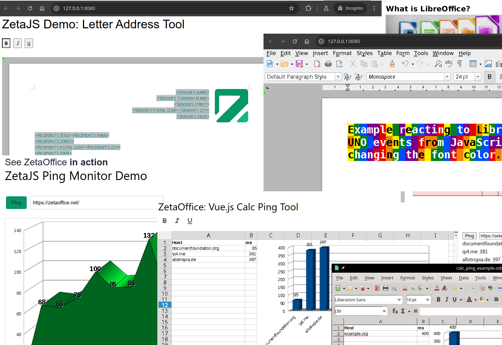

# zetajs: Access ZetaOffice in the Browser from JavaScript via UNO

The zetajs library provides the facilities to run an instance of ZetaOffice integrated in your
web site, allowing you to control it with JavaScript code via the LibreOffice
[UNO](https://wiki.documentfoundation.org/Documentation/DevGuide) technology.

Use cases range from an in-browser office suite that looks and feels just like its desktop
counterpart, to fine-tuned custom text editing and spreadsheet capabilities embedded in your web
site, to a headless zetajs instance that does document conversion in the background.

For a detailed description of zetajs, see the [Starting Points](docs/start.md) documentation.

(Technically, zetajs provides a wrapper on top of the
[Embind-based](https://blog.allotropia.de/2024/04/30/libreoffice-javascripted/) JavaScript scripting
capabilities for LibreOffice. But it aims to provide a nicer, more idiomatic JavaScript experience,
and completely hides the underlying machinery. In the future, it may even move away from that
underlying Embind layer, in a backward-compatible way.)

## Using ZetaOffice

Visit [zetaoffice.net](https://zetaoffice.net) to learn more about ZetaOffice, its CDN and how to host ZetaOffice yourself.

### Demo
To see a demo of zetajs in use, visit [zetaoffice.net/#tryit](https://zetaoffice.net/#tryit).



### Examples and test code

Check out our examples. Each example has instructions how to run it in its respective folder.

| Example | Description | Toolkits/Libraries | Online Demo |
| --- | --- | --- | --- |
| [standalone](https://github.com/allotropia/zetajs/tree/main/examples/standalone) | Standalone Writer document canvas with simple formatting options. *Simple code, easy to start with* | Bootstrap |https://zetaoffice.net/demos/standalone/ |
| [letter-address-vuejs3](https://github.com/allotropia/zetajs/tree/main/examples/letter-address-vuejs3) | Web form letter demo | Vue, w3.css | https://zetaoffice.net/demos/letter-address-vuejs3/
| [web-office](https://github.com/allotropia/zetajs/tree/main/examples/web-office) | Full office suite in the browser | Vue, w3.css | https://zetaoffice.net/demos/web-office/
| [ping-monitor](https://github.com/allotropia/zetajs/tree/main/examples/ping-monitor) | Chart with values being added on the fly | w3.css, ping.js | https://zetaoffice.net/demos/ping-monitor/
| [vuejs3-ping-tool](https://github.com/allotropia/zetajs/tree/main/examples/vuejs3-ping-tool) | Chart with values being added on the fly | Vue, ping.js | https://zetaoffice.net/demos/vuejs3-ping-tool/
| [convertpdf](https://github.com/allotropia/zetajs/tree/main/examples/convertpdf) | local file to PDF conversion service | Plain javascript | https://zetaoffice.net/demos/convertpdf/
| [simple-examples](https://github.com/allotropia/zetajs/tree/main/examples/simple-examples) | small examples displaying various API features | Plain javascript

These examples use the ZetaOffice CDN to get you started quickly.

## Why zetajs

See how zetajs makes scripting ZetaOffice easy, building on the foundation of the LibreOffice UNO API:

### 1. Load a document

```javascript
const css = zetajs.uno.com.sun.star;
const desktop = css.frame.Desktop.create(zetajs.getUnoComponentContext());
let xModel = desktop.getCurrentFrame().getController().getModel();
if (!xModel?.queryInterface(zetajs.type.interface(css.text.XTextDocument))) {
    xModel = desktop.loadComponentFromURL(
        'file:///android/default-document/example.odt', '_default', 0, []);
}
```

### 2. Change each paragraph in Writer into a random color

```javascript
const xText = xModel.getText();
const xParaEnumeration = xText.createEnumeration();
for (const xParagraph of xParaEnumeration) {
    const color = Math.floor(Math.random() * 0xFFFFFF);
    xParagraph.setPropertyValue("CharColor", color);
}
```

## Using with an own build

Please have a look into the respective config.sample.js file of each demo to use another ZetaOffice build.

You may also compile a custom [LOWA build](https://git.libreoffice.org/core/+/refs/heads/master/static/README.wasm.md). There the folder `workdir/installation/LibreOffice/emscripten/` will contain the files for the web root. If you host the WASM binary on another origin then the example code you will need to set a [CORS header](https://developer.mozilla.org/docs/Web/HTTP/CORS).

For the sources of the WASM binaries served by cdn.zetaoffice.net see:
* https://git.libreoffice.org/core/+/refs/heads/distro/allotropia/zeta-24-2
* https://github.com/allotropia/emscripten/commits/fixed-3.1.65
* https://github.com/allotropia/qt5/tree/5.15.2%2Bwasm
* https://github.com/allotropia/qtbase/tree/5.15.2%2Bwasm

## Contributions

### Submitting issues

First off, please search existing issues first, before filing a new
one (see [search on github](https://help.github.com/articles/searching-issues)).

If you think you've found a security problem, feel free to contact one
of the project maintainers in private, for responsible disclosure.

### Development and Code

For any LibreOffice questions (code, API, features), you'll find us on
the [LibreOffice IRC channel](https://web.libera.chat/?channels=libreoffice-dev) - changes
to LibreOffice core then go through
[TDF's development process and gerrit code review system](https://wiki.documentfoundation.org/Development/GetInvolved).

For changes to the zetajs library, just raise a pull request here, and
make sure you've got permission to contribute your changes under the
MIT license. For that, we use the [Developer Certificate of Origin (DCO)](https://developercertificate.org/):

~~~
Developer Certificate of Origin
Version 1.1

Copyright (C) 2004, 2006 The Linux Foundation and its contributors.

Everyone is permitted to copy and distribute verbatim copies of this
license document, but changing it is not allowed.


Developer's Certificate of Origin 1.1

By making a contribution to this project, I certify that:

(a) The contribution was created in whole or in part by me and I
    have the right to submit it under the open source license
    indicated in the file; or

(b) The contribution is based upon previous work that, to the best
    of my knowledge, is covered under an appropriate open source
    license and I have the right under that license to submit that
    work with modifications, whether created in whole or in part
    by me, under the same open source license (unless I am
    permitted to submit under a different license), as indicated
    in the file; or

(c) The contribution was provided directly to me by some other
    person who certified (a), (b) or (c) and I have not modified
    it.

(d) I understand and agree that this project and the contribution
    are public and that a record of the contribution (including all
    personal information I submit with it, including my sign-off) is
    maintained indefinitely and may be redistributed consistent with
    this project or the open source license(s) involved.
~~~

When submitting a pull request, to make this certification please
therefore add a sign-off line to your commits:

~~~
  Signed-off-by: Random J Developer <random@developer.example.org>
~~~

Use your real name (sorry, no pseudonyms or anonymous
contributions).

This project is tested with BrowserStack.
